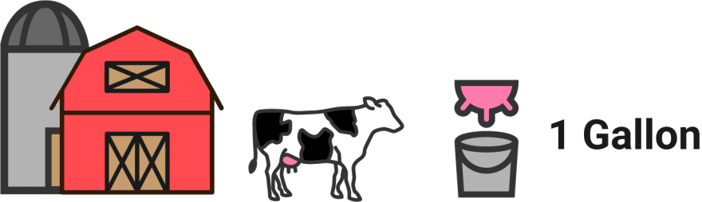
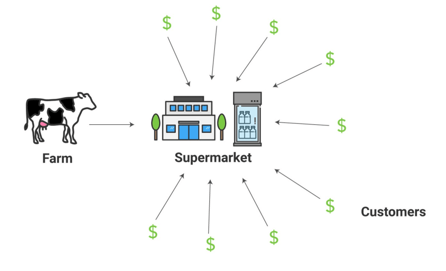
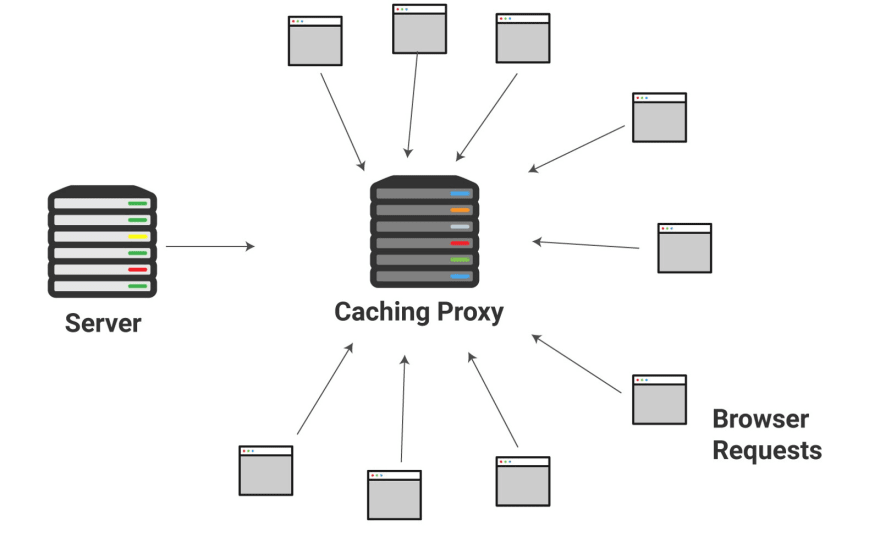

原文：[Web Caching Explained by Buying Milk at the Supermarket
](https://dev.to/kbk0125/web-caching-explained-by-buying-milk-at-the-supermarket-9k4)

## 通过在超市买牛奶解释缓存机制(译)
**如果你在曾经在超市买过牛奶，那么你就可以理解服务器端和浏览器端的缓存机制了。**

如果你是一个狂热的网络使用者(你很可能是)，那么你已经很多次享受到缓存所带来的好处了。但是，你可能并不知道它其中的奥妙，以及它是如何或什么时候运行的。

从开发者角度来看，缓存使得构建高性能 web 应用和 web 服务器更加容易。开发人员可以利用缓存协议，从而达到生活美满，幸福安康。而不需要不断地去优化被成千上万个请求淹没的服务器。

经过在以前的项目中使用缓存，我意识到相比于一些烂大街的术语，有一种更好的方法去解释它。我意识到它和牛奶从农场，再到你的冰箱的这个方式非常相似，所以我认为这会是一种更好的解释方式。

为了读懂这篇指南，你需要知道一些 [web 服务器的基础知识](https://blog.codeanalogies.com/2018/04/26/web-servers-explained-by-running-a-microbrewery/)。让我们开始吧！

### 互联网没有缓存将会是什么样子
在进入主题之前，让我们想想如果没有缓存，互联网将会是什么样子。想象一哈，你生活中70世纪或80世纪的农村。你拥有一个农场，并且你的农场没有冰箱可以用。你的农场里有不少牛，但是它们的奶几乎没有任何价值，因为牛奶很快就会变质。

好了，现在你想把牛奶卖给你们村庄的人，并且需要在限定的时间内喝掉牛奶(容易变质)。让我们假设你的每头牛每天产出1加仑的牛奶。但是如果太多人来找你买牛奶，你就需要先送一部分人回家，让他们明天再来。

同时，由于你分身乏力，自然也不可以通过买更多的奶牛来增加产出(农场原因)。只有你们村的村民才可以买你的牛奶(地理原因)。这些都是明确的限制。

没有缓存，你将受限于服务器的计算能力。

而缓存用来加载静态资源，如：
- Images
- CSS
- Static HTML files
- JavaScript files

默认情况下，服务器必须响应每一个传入的请求。但是，一个页面的加载实际上可能意味着四个单独的请求，用于加载上面的资源。当你考虑到使用体积更大的图片时，你的服务器可能会被来自世界各地的用户所淹没。这时，用户需要等待页面的缓慢加载。

理想情况下，你想通过存储常用的请求响应来减轻服务器的负担。这样你不需要再去处理每一个请求，你可以通过缓存可以立即响应请求。当然，你也可以部署更多的服务器，但是这会需要更多的支出。

### 什么是服务器端缓存
回到我们的农场，知道怎么样可以更容易的运营一家奶牛农场吗？

一个有冰箱的超市！

用这种方式，人们不需要去到你的农场，或为了防止牛奶变质马上喝掉。你现在可以用一种安全的方式放置牛奶，一次几个星期都不会变质。

超市为你的农场分担了很大一部分运营压力，因为你的奶牛不再需要根据顾客的多少实时产出了。超市将会处理这些需求。你只需要确保奶牛日产量达到标准就好。现在，周围的村庄也可以买你农场的牛奶了，因为在超市的冰箱就可以买到。

就像超市一样，服务器端的缓存将会处理大量的请求，并且数据的响应也更快、更可靠。

在上图中，我用了 **缓存代理** 这个术语。一个缓存代理是一个服务，它可以存储静态资源文件去响应一些常用请求。一个缓存代理可以拦截常用请求并快速响应，可以防止这些请求对你的主服务增加压力。

你可能有一对问题想问，例如：
1. 一个 "常用" 请求是怎么定义的？
2. 代理的缓存会保存多久？

设置缓存需要一个更长的教程来讲解。现在，你需要知道一个重要的概念——**新鲜度**。
缓存代理将在不同的时间下，缓存不同的文件，并且需要决定是否继续提供这些文件。
这些都取决于你的 **缓存策略**。

它的运行机制和牛奶在超市一摸一样。超市经理需要决定，在扔掉它们之前(变质)，保留你的牛奶到什么时候。缓存代理通过 **缓存命中率** 来衡量是否成功，这部分的内容可以通过缓存代理提供服务。

### 什么是CDN
